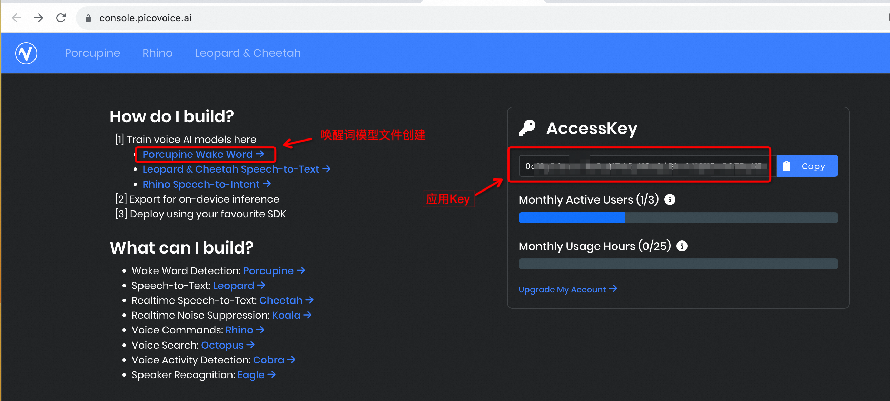
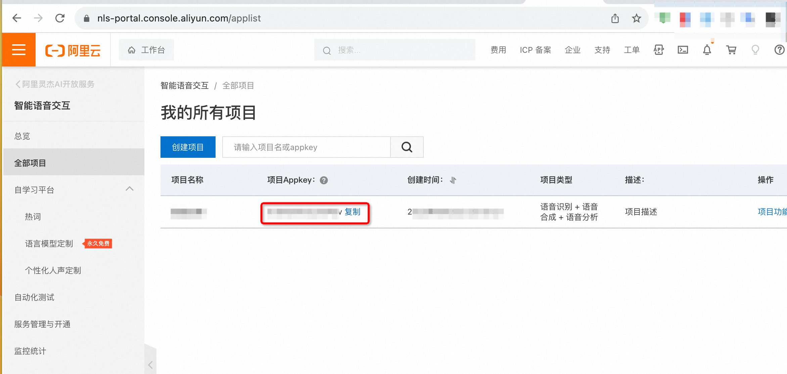
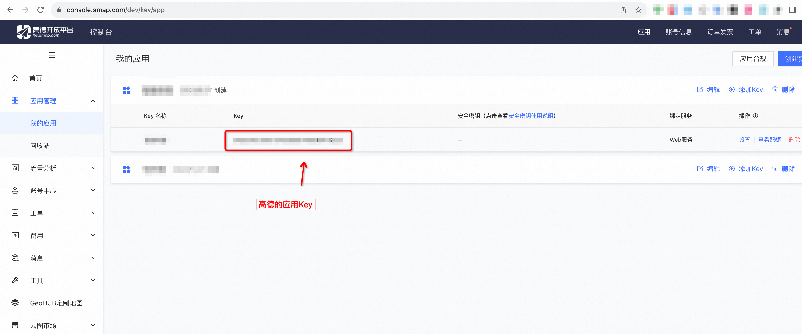

## 主要功能
1. 使用Picovoice实现了语音唤醒
2. 使用阿里云的NLS实现语音识别与合成
3. 支持ChatGPT持续对话以及函数调用（当前已支持查询实时天气和时间）

## 配置&启动
```shell
# 创建虚拟环境
python3 -m venv .venv
# 激活虚拟环境
source .venv/bin/activate
# 安装依赖
pip install requests pvporcupine simpleaudio SpeechRecognition pvrecorder
# 修改各种Key和配置项
vim config.py
# 启动
python3 main.py
```

## 第三方平台账号注册

### 一、Picovoice 唤醒词
官网：https://picovoice.ai/
> 不建议使用QQ邮箱注册，容易被封号



### 二、阿里云 语音识别与合成
官网：https://ai.aliyun.com/nls
1. 先创建一个语音识别项目，得到AppKey

2. 再创建一个RAM账号，得到AK/SK。该账号主要作用是用于自动获得授权Token。该RAM账号只需使用以下最小权限
```json
{
    "Version": "1",
    "Statement": [
        {
            "Effect": "Allow",
            "Action": "nls:CreateToken",
            "Resource": "*"
        }
    ]
}
```

### 三、高德 IP定位、天气查询
官网：https://lbs.amap.com/



## 参考项目
https://github.com/MedalCollector/Orator
